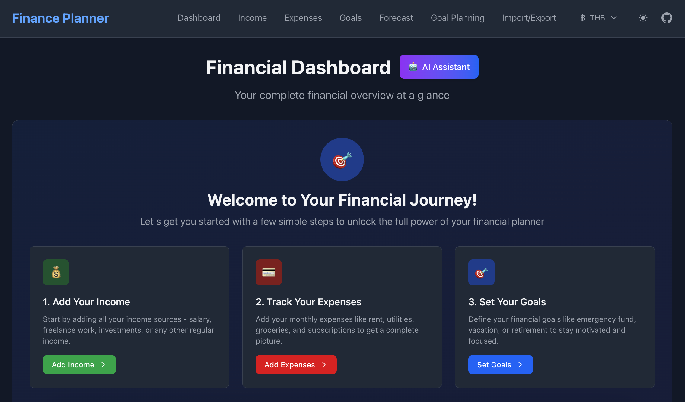
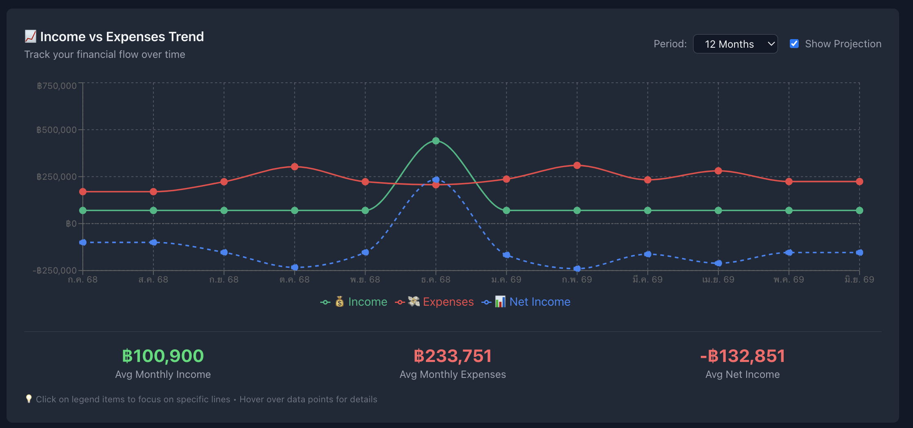
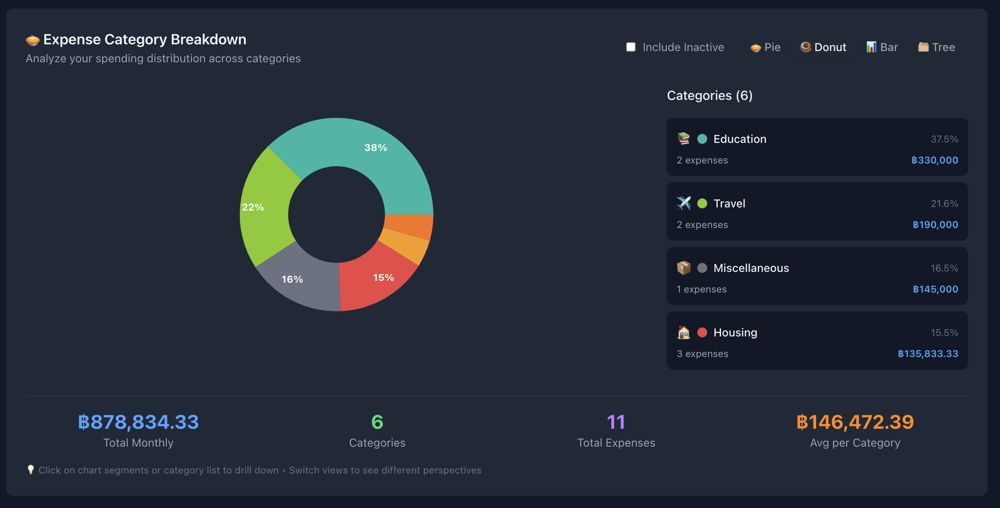
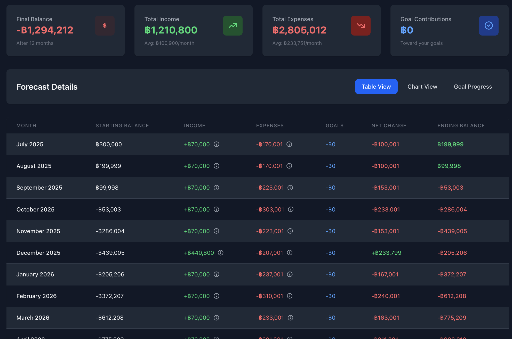

# Personal Finance Planner

> **Note:** This is a fun personal project made to solve my own pain in planning my financial situation. Built over a weekend, 100% of code are built by AI using [Cursor](https://cursor.com/), Claude 4 Sonnet, and [Taskmaster](https://github.com/eyaltoledano/claude-task-master). **Hope this helps anyone!**

[](https://nextjs.org/) [](https://react.dev/) [](https://tailwindcss.com/) [](https://www.typescriptlang.org/) [](https://recharts.org/)



<p align="center"><i>📸 Dashboard: Your complete financial overview at a glance</i></p>

## 📷 Screenshots



<p align="center"><i>Income vs Expenses Trend: Track your financial flow over time</i></p>



<p align="center"><i>Expense Category Breakdown: Analyze your spending distribution across categories</i></p>



<p align="center"><i>Forecast Table: See your projected balances month by month</i></p>

A modern, open-source personal finance planning app to help you manage your income, expenses, goals, and forecast your financial future. Built with Next.js, React, Tailwind CSS, TypeScript, and Recharts. Includes multi-currency, multi-language (EN/TH, **localization WIP**), light/dark themes, and robust data persistence. **AI-powered suggestions are on the roadmap—currently, you can generate prompts to copy into your favorite LLM!**

---

## 🚀 Features

- **Dashboard Overview**: Get a high-level summary of your financial situation, including annual income, expenses, net income, savings rate, top expense categories, upcoming goals, and personalized suggestions.
- **Income Management**: Add, edit, and track multiple income sources with support for recurring, one-time, and time-bound income.
- **Expense Tracking**: Manage recurring and one-time expenses, categorize spending, and handle installment payments.
- **Financial Goals**: Set, track, and prioritize financial goals with progress tracking, forecast-based completion dates, and smart allocation.
- **Goal Planning & Allocation**: Visualize and plan monthly goal allocations with calendar, table, and chart views. Get actionable guidance for achieving your goals.
- **Financial Forecasting**: Generate multi-year projections based on your income, expenses, and goals. Adjust starting balance, forecast period, and see the impact of your plans.
- **Data Visualization**: Interactive charts for income vs. expenses, expense categories, and goal progress using Recharts.
- **Multi-Currency Support**: Choose from popular currencies (THB, USD, EUR, etc.) with global formatting and persistence.
- **Multi-Language Support**: Switch between English and Thai (EN/TH). **Localization is still a work in progress (WIP).**
- **Light/Dark Theme**: Toggle between light and dark modes for comfortable viewing.
- **Data Persistence**: All data is saved to your browser's localStorage with automatic backup and restore. Import/export your full plan as JSON or CSV.
- **Settings Persistence**: Theme, currency, and language preferences are saved and included in import/export.
- **Mobile Responsive**: Fully responsive design for desktop, tablet, and mobile.
- **Accessible & Modern UI**: Built with accessibility and UX best practices.
- **AI-Powered Suggestions (Roadmap)**: AI-powered financial suggestions are planned. **For now, you can generate prompts to copy into your favorite LLM (ChatGPT, Claude, etc.) for analysis!**

---

## 🏗️ Project Structure & Task Management

This project is managed with [Taskmaster](https://github.com/eyaltoledano/claude-task-master) for clear, structured development. All major features, modules, and improvements are tracked in [`tasks.json`](.taskmaster/tasks/tasks.json) (auto-generated by Taskmaster). See the file for a detailed breakdown of:

- Core modules (dashboard, income, expenses, goals, forecast, goal planning)
- UI/UX improvements
- Data models and persistence
- AI integration
- Localization and settings
- Charting and analytics
- Import/export and backup

---

## 📦 Tech Stack

- **Next.js** (App Router, SSR, client components)
- **React 19**
- **TypeScript**
- **Tailwind CSS 4**
- **Recharts** (data visualization)
- **OpenRouter API** (AI-powered insights, roadmap)
- **Taskmaster** (task management)

---

## 🛠️ Getting Started

### 1. Clone the Repo

```bash
git clone https://github.com/oofangoo/personal-finance-planner.git
cd personal-finance-planner
```

### 2. Install Dependencies

```bash
npm install
# or
yarn install
```

### 3. Run the Development Server

```bash
npm run dev
# or
yarn dev
```

Open [http://localhost:3000](http://localhost:3000) in your browser.

### 4. Build for Production

```bash
npm run build
npm start
```

---

## 🧩 Core Data Models

- **Income**: name, amount, frequency, start/end date, isActive
- **Expense**: name, amount, category, due date, recurring, frequency, priority, isActive, installment options
- **Goal**: name, target amount, target date, current amount, category, priority, isActive, type (fixed/open-ended), priority order
- **Forecast**: month, projected balance, income, expenses, goal contributions
- **UserPlan**: All user data (income, expenses, goals, forecast, config, current balance)

See [`types/index.ts`](types/index.ts) for full TypeScript interfaces.

---

## 📊 Major Modules & Pages

- **Dashboard**: Overview, stats, charts, suggestions
- **Income**: Add/edit/manage income sources
- **Expenses**: Add/edit/manage expenses, categories, installments
- **Goals**: Set, track, and prioritize goals
- **Goal Planning**: Monthly allocation breakdown, calendar, export
- **Forecast**: Multi-year projections, starting balance, scenario planning
- **Import/Export**: Backup and restore your plan (JSON/CSV)
- **Settings**: Theme, currency, language (auto-persisted)
- **AI Insights**: Generate prompts for your favorite LLM (AI-powered suggestions coming soon!)

---

## 🌐 Localization & Internationalization

- **Languages**: English (EN) and Thai (TH) supported (**localization is WIP**)
- **Currencies**: THB, USD, EUR, GBP, JPY, AUD, CAD, CHF, CNY, SGD, INR, KRW
- **Theme**: Light and dark modes
- **Settings**: All preferences are saved and included in import/export

---

## 🔒 Data Persistence & Security

- All data is stored in your browser's localStorage (no cloud storage by default)
- Automatic backup before every save
- Import/export your full plan for backup or migration
- No personal data is sent to any server except for optional AI analysis (OpenRouter, roadmap)

---

## 🤖 AI-Powered Insights (Roadmap)

- **AI-powered suggestions are planned for the future!**
- For now, you can generate prompts to copy into your favorite LLM (ChatGPT, Claude, etc.) for financial analysis and advice.
- All analysis is performed client-side except for the AI API call (when enabled in the future)

---

## 📈 Data Visualization

- Interactive charts for income vs. expenses, expense categories, and goal progress
- Drill-down, tooltips, and multiple view modes
- Built with [Recharts](https://recharts.org/)

---

## 🧑‍💻 Contributing

Contributions are welcome! Please open issues or pull requests for bugs, features, or improvements.

---

## 🔗 Links

- [GitHub Repository](https://github.com/oofangoo/personal-finance-planner)
- [LinkedIn (Thunyut Chienpairoj)](https://www.linkedin.com/in/thunyut/)
- [Taskmaster Project Management](https://github.com/eyaltoledano/claude-task-master)

---

## 📄 License

MIT License. See [LICENSE](LICENSE) for details.
